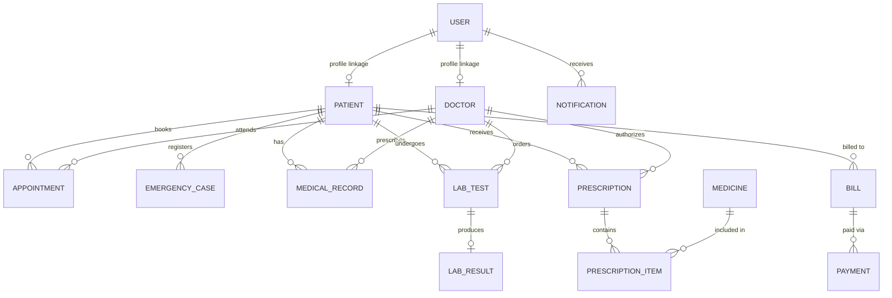

# Hospital Management System (Spring Boot College Project)

> **Integrated Hospital Operations Platform** covering Patient & Doctor Management, Smart Queueing, Medical Records, Laboratory & Pharmacy, Billing & Reporting (REST + SOAP Web Services), and JWT Security with System Monitoring.

---

## 📌 1. Project Objective & Problem Statement

### **Problem Statement**
Traditional hospital administration systems operate in disconnected silos—patient registration, appointment booking, pharmacy inventories, laboratory results, and billing records are managed separately. This results in double-bookings, long patient wait times, medication safety hazards (e.g. prescribing drugs against patient allergies), delayed billing, and a lack of real-time operational visibility.

### **Proposed Solution**
An integrated, monolithic Java Spring Boot system that unifies all 5 core hospital workflows. The system features:
- **Rule-Based Smart Queue & Emergency Prioritization**: Dynamically calculates patient wait times and places emergency cases ahead of normal queues.
- **Rule-Based Medication Safety Engine**: Automatically checks patient allergies and drug stock before confirming prescriptions.
- **Dual Reporting Protocol**: Provides REST APIs for modern web/mobile interfaces and real **Spring Web Services SOAP Endpoints (`/ws/reports.wsdl`)** for enterprise report generation.
- **Stateless JWT Security & System Monitoring**: Role-based access control (`ADMIN`, `DOCTOR`, `PATIENT`), Spring AOP performance logging, and real-time system metrics monitoring.

---

## 🏗️ 2. Official 5 Modules (Presentation PPT Alignment)

| Module | Core Features | Official Components |
| :--- | :--- | :--- |
| **Module 1: Patient & Doctor Management** | Patient registration, doctor specializations, search & profile lookup, Rule-Based doctor recommendation by symptoms. | `PatientController`, `DoctorController`, `PatientService`, `DoctorService`, `DoctorRecommendationService` |
| **Module 2: Smart Appointment & Emergency Management** | Double-booking prevention, appointment status tracking (`BOOKED`, `WAITING`, `IN_PROGRESS`, `COMPLETED`, `CANCELLED`), Rule-Based Smart Queue calculation, Emergency severity override (`LOW`, `MEDIUM`, `HIGH`, `CRITICAL`) with `@Transactional` queue insertion. | `AppointmentController`, `EmergencyController`, `AppointmentService`, `EmergencyService`, `QueuePredictionService`, `EmergencyPriorityService` |
| **Module 3: Medical Records, Laboratory & Pharmacy** | Diagnostic consultation records, lab test workflow (`REQUESTED` -> `IN_PROGRESS` -> `COMPLETED`), lab result linkage, Rule-Based Medication Safety validation (allergy matching & stock verification), atomic inventory deduction. | `MedicalRecordController`, `LaboratoryController`, `PharmacyController`, `MedicalRecordService`, `LaboratoryService`, `PharmacyService`, `MedicationSafetyService` |
| **Module 4: Billing & Reporting Management** | Automatic total fee calculation (`consultationFee + laboratoryFee + pharmacyFee`), payment tracking (`PENDING`, `PAID`, `FAILED`), REST report endpoints, Real Spring WS SOAP Web Service endpoint (`/ws/reports.wsdl`). | `BillingController`, `ReportController`, `BillingService`, `ReportService`, `WebServiceConfig`, `ReportSoapEndpoint` |
| **Module 5: Security, Notification & Monitoring** | Spring Security 6 with JWT authentication, BCrypt password hashing, database-backed notifications, Spring AOP execution logger (`LoggingAspect`), system health & metric endpoints (`/api/monitoring`), Centralized Exception Handling (`@RestControllerAdvice`). | `AuthenticationController`, `NotificationController`, `MonitoringController`, `JwtService`, `SecurityConfig`, `LoggingAspect`, `GlobalExceptionHandler` |

---

## 🛠️ 3. Technology Stack

- **Backend**: Java 17/25, Spring Boot 3.3.2, Spring MVC, Spring Data JPA, Hibernate, Spring REST, Spring Validation (Jakarta), Spring Transaction Management, Spring AOP, Spring Security 6, Spring Web Services (SOAP).
- **Database**: MySQL Server (`hospital_db`) with H2 embedded in-memory database for automated testing.
- **Security**: JSON Web Tokens (JJWT 0.12.6), BCrypt Password Encoder.
- **Build & Management**: Maven Wrapper (`mvnw.cmd` / `mvnw`).
- **Testing**: JUnit 5, Mockito, Postman Collection (`Hospital Management System.postman_collection.json`).

---

## 🗄️ 4. Database Schema & Entity Relationships



---

## 🚀 5. Setup & How to Run Instructions

### Prerequisites
1. **Java JDK 17+** installed (`java -version`).
2. **MySQL Server** running on `localhost:3306` with default database `hospital_db` (or updated credentials in `src/main/resources/application.properties`).

### Step 1: Clone & Navigate
```bash
git clone https://github.com/your-username/Hospital-Management-System.git
cd Hospital-Management-System
```

### Step 2: Configure Database Credentials
In `src/main/resources/application.properties`:
```properties
spring.datasource.url=jdbc:mysql://localhost:3306/hospital_db?createDatabaseIfNotExist=true&useSSL=false&allowPublicKeyRetrieval=true&serverTimezone=UTC
spring.datasource.username=root
spring.datasource.password=root
```

### Step 3: Compile & Run Tests
```bash
.\mvnw.cmd clean test
```

### Step 4: Run Application
```bash
.\mvnw.cmd spring-boot:run
```
The application will start on **`http://localhost:8080`**.

---

## 📡 6. Key REST & SOAP API Endpoints

### Authentication (`/api/auth`)
- `POST /api/auth/register`: Register new user (`ADMIN`, `DOCTOR`, `PATIENT`).
- `POST /api/auth/login`: Authenticate and receive JWT Bearer token.

### Patient & Doctor Management (`/api/patients`, `/api/doctors`)
- `POST /api/patients`: Register patient.
- `GET /api/patients`: List all patients.
- `GET /api/patients/{id}`: Get patient details.
- `POST /api/doctors`: Register doctor.
- `GET /api/doctors/recommend?symptoms=chest pain`: Rule-Based doctor recommendation by symptoms.

### Smart Appointments & Emergency (`/api/appointments`, `/api/emergencies`)
- `POST /api/appointments`: Book appointment (Validates doctor availability, checks double-booking, calculates queue position & wait time).
- `PUT /api/appointments/{id}/reschedule?newTime=11:30 AM`: Reschedule appointment.
- `PUT /api/appointments/{id}/cancel`: Cancel appointment.
- `POST /api/emergencies?patientId=1&severity=CRITICAL&description=Severe chest pain`: Register emergency case (calculates priority 4 and overrides queue).

### Laboratory & Pharmacy (`/api/lab-tests`, `/api/prescriptions`)
- `POST /api/lab-tests`: Doctor requests lab test.
- `POST /api/lab-results`: Lab technician submits lab result.
- `POST /api/prescriptions`: Doctor issues prescription (Medication Safety Service checks patient allergies & stock availability).

### Billing & Reports (`/api/billing`, `/api/reports`)
- `POST /api/billing`: Generate bill (`consultationFee + laboratoryFee + pharmacyFee`).
- `POST /api/billing/{id}/payment`: Process bill payment.
- `GET /api/reports/patient/{id}`: Patient medical report.
- `GET /api/reports/statistics`: Overall hospital operational statistics.

### SOAP Web Service (`/ws`)
- **WSDL URL**: `http://localhost:8080/ws/reports.wsdl`
- **Supported Operations**:
  1. `GetPatientMedicalReportRequest` -> Returns complete patient history in XML format.
  2. `GetBillingReportRequest` -> Returns breakdown of patient bills and payment status in XML format.

### System Monitoring (`/api/monitoring`)
- `GET /api/monitoring`: System health, uptime, memory usage, and database record counters.

---

## 📬 7. Postman Collection Testing

A complete Postman collection is included in the project root:
📄 **`Hospital Management System.postman_collection.json`**

Import this file into Postman to test all 12 organized API folders:
1. `01 Authentication`
2. `02 Patients`
3. `03 Doctors`
4. `04 Appointments`
5. `05 Emergency`
6. `06 Medical Records`
7. `07 Laboratory`
8. `08 Pharmacy`
9. `09 Billing`
10. `10 Reports`
11. `11 Notifications`
12. `12 Monitoring`

---

## 🤖 8. Future Machine Learning Roadmap

As stated in the presentation PPT, intelligent features currently rely on **Rule-Based Services**. The code is architected using decoupled interfaces so Machine Learning models can be integrated as future enhancements without breaking controller contracts:

| Service | Current Rule-Based Implementation | Future ML Enhancement |
| :--- | :--- | :--- |
| **`DoctorRecommendationService`** | Keyword & symptom matching (e.g. "chest pain" -> Cardiology) | NLP Clinical Entity Recognition model trained on patient EMR data. |
| **`QueuePredictionService`** | Constant average consultation time $\times$ patients ahead | XGBoost / Random Forest regression model trained on doctor historical consultation times. |
| **`EmergencyPriorityService`** | Static severity mapping (LOW=1, MEDIUM=2, HIGH=3, CRITICAL=4) | Triage Neural Network evaluating vital signs (heart rate, SpO2, blood pressure). |
| **`MedicationSafetyService`** | Patient recorded allergy text matching & stock check | Drug-Drug Interaction (DDI) Knowledge Graph & Deep Learning safety predictor. |
